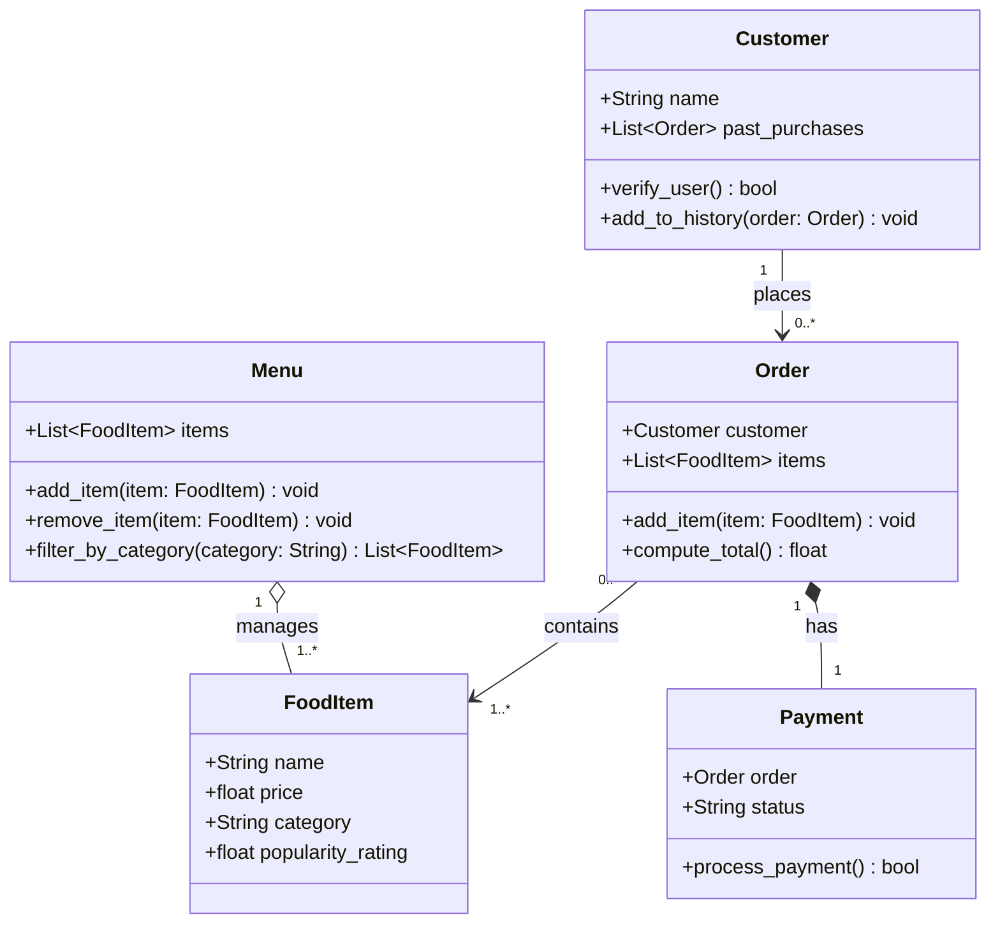

# ByteBites UML Class Diagram (Revised)

## Class Descriptions

| Class | Responsibility |
|-------|----------------|
| **Customer** | Stores the customer's name and order history; `verify_user()` confirms a real user, `add_to_history()` records completed orders |
| **FoodItem** | A single menu item with its name, price, category, and popularity rating |
| **Menu** | Holds the full catalog of food items; supports adding, removing, and filtering items by category (e.g. "Drinks", "Desserts") |
| **Order** | Groups selected food items into one transaction linked to a customer; `add_item()` builds the order, `compute_total()` calculates the cost |
| **Payment** | Tracks whether an order has been paid; `process_payment()` attempts the transaction and returns success/failure |

## Relationships

| Relationship | Type | Meaning |
|---|---|---|
| Customer → Order | Association (1 to 0..*) | A customer places zero or more orders |
| Menu ◇→ FoodItem | Aggregation (1 to 1..*) | Menu manages the collection of food items |
| Order → FoodItem | Association (0..* to 1..*) | An order contains one or more food items |
| Order ◆→ Payment | Composition (1 to 1) | Each order owns exactly one payment record |

## What Changed from Draft 1

| Element | Change | Reason |
|---|---|---|
| `Order.payment_status` | Removed | Duplicate — `Payment.status` owns this |
| `Order.add_item()` | Added | Models the act of picking items into a transaction |
| `Customer.add_to_history()` | Added | Explicitly captures how completed orders are stored |
| `Menu.remove_item()` | Added | Pairs with `add_item()` for complete catalog management |
| `Payment.amount` | Removed | Redundant with `Order.compute_total()` |
