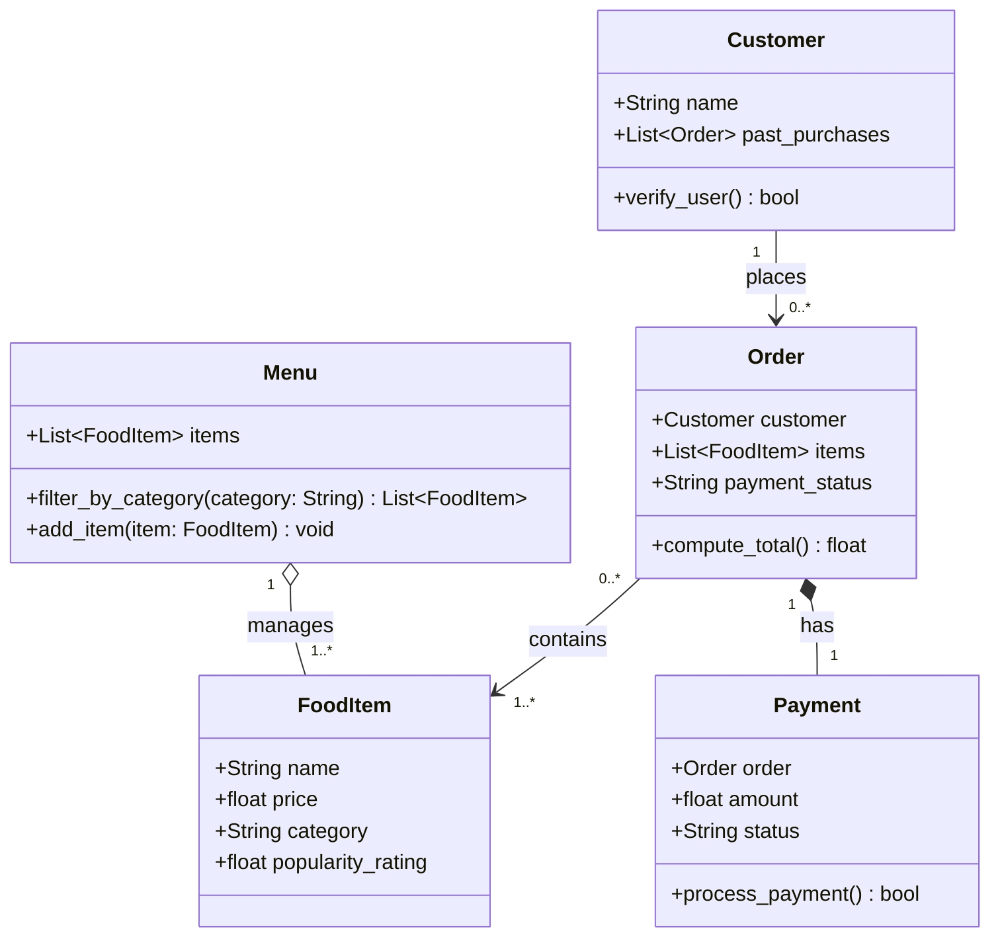

# ByteBites UML Class Diagram

## Class Descriptions

| Class | Responsibility |
|-------|---------------|
| **Customer** | Stores the customer's name and their order history; used to verify real users |
| **FoodItem** | Represents a single menu item with its name, price, category, and popularity rating |
| **Menu** | Holds the full catalog of food items and provides filtering by category (e.g. "Drinks", "Desserts") |
| **Order** | Groups selected food items into one transaction, linked to a customer, and tracks payment status |
| **Payment** | Records how much an order cost and tracks whether it has been paid |

## Relationships

| Relationship | Type | Meaning |
|---|---|---|
| Customer → Order | Association (1 to 0..*) | A customer places zero or more orders |
| Menu ◇→ FoodItem | Aggregation (1 to 1..*) | Menu manages the collection of food items |
| Order → FoodItem | Association (0..* to 1..*) | An order contains one or more food items from the menu |
| Order ◆→ Payment | Composition (1 to 1) | Each order owns exactly one payment record |
